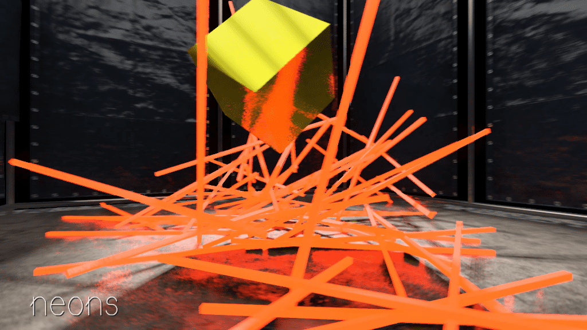

# DREVERSED



**DREVERSED** is an experimental demo about time, physics and simulation.  
Each sequence is a reversed replay of a physics simulation computed in real time during the previous segment.  
The project explores the **irreversibility of physical processes** - a direct echo to [Loschmidt’s paradox](https://en.wikipedia.org/wiki/Loschmidt%27s_paradox).

DREVERSED was created for [**API8**](https://www.api8.fr/), a demoscene-inspired event at [Paris 8 University](https://www.univ-paris8.fr/) blending research, real-time art and education.  
It was (semi) intentionally designed not to behave identically on every machine, embracing the *unstable identity* of digital time.

## 🎛️ Technical Details

- Released at **API8 2025** (Université Paris 8) – not ranked
- Written in **Lua**, using the [**Harfang 3D engine**](https://github.com/harfang3d/harfang3d)
- Runs on **Windows** (x64, DX11) and **Linux** (x64, OpenGL)

## 🧪 Runtime Behavior

This demo captures each physical scene by recording world matrices of each physical object, frame-by-frame.  
Replay is not a fixed timeline — it’s stretched, looped, reversed.  
Timing may vary depending on your monitor's refresh rate. 60Hz is optimal.

## 🕹️ How to Run

### Windows

Double-click:

```bat
start-demo.bat
```

### Linux

```bash
./start-demo.sh
```

## 📎 Links

- 📽️ [YouTube capture](https://www.youtube.com/watch?v=gm-Rr5OQvN0)  
- 🖼️ [Pouët release page](https://www.pouet.net/prod.php?which=104173)  
- 💾 [Download & binaries](https://github.com/astrofra/demo-api8-dreversed/releases)

## 👤 Credits

- Fra (Code/Design)  
- Riddlemak (Music)  
- XBarr (Engine)  
- CirrusCumulus font by Clara Sambot — [velvetyne.fr](https://velvetyne.fr/)  
- Additional 3D models by Jack-3D, Yuri3D and Dekogon  
- Interview with Edmond Couchot by Alain Longuet
